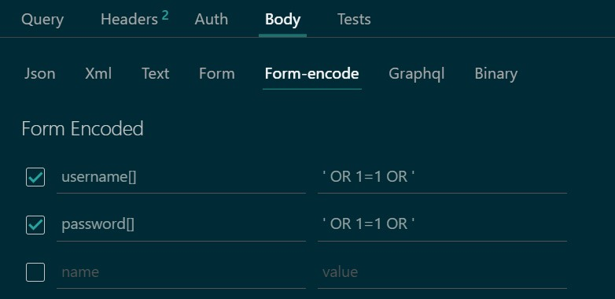

# `web`/Babier CSP [349 solves/107 points]


---

# `web`/Missing Flavortext [224 solves/111 points]

Hmm, it looks like there's no flavortext here. Can you try and find it?

```js
const crypto = require('crypto');
const db = require('better-sqlite3')('db.sqlite3')

// remake the `users` table
db.exec(`DROP TABLE IF EXISTS users;`);
db.exec(`CREATE TABLE users(
  id INTEGER PRIMARY KEY AUTOINCREMENT,
  username TEXT,
  password TEXT
);`);

// add an admin user with a random password
db.exec(`INSERT INTO users (username, password) VALUES (
  'admin',
  '${crypto.randomBytes(16).toString('hex')}'
)`);

const express = require('express');
const bodyParser = require('body-parser');

const app = express();

// parse json and serve static files
app.use(bodyParser.urlencoded({ extended: true }));
app.use(express.static('static'));

// login route
app.post('/login', (req, res) => {
  if (!req.body.username || !req.body.password) {
    return res.redirect('/');
  }

  if ([req.body.username, req.body.password].some(v => v.includes('\''))) {
    return res.redirect('/');
  }

  // see if user is in database
  const query = `SELECT id FROM users WHERE
    username = '${req.body.username}' AND
    password = '${req.body.password}'
  `;

  let id;
  try { id = db.prepare(query).get()?.id } catch {
    return res.redirect('/');
  }

  // correct login
  if (id) return res.sendFile('flag.html', { root: __dirname });

  // incorrect login
  return res.redirect('/');
});

app.listen(3000);
```

What this setting allows is for **other types (arrays, objects) to be passed in, instead of merely just a string.**

```js
app.use(bodyParser.urlencoded({ extended: true }));
```

<br />

A payload like:

Will get treated as an array, rather than a string.

**SQL Injection** work!

<br/>

## Better Practice
```js
const username = req.body.username?.toString() ?? ""
const password = req.body.password?.toString() ?? ""　
```

---

